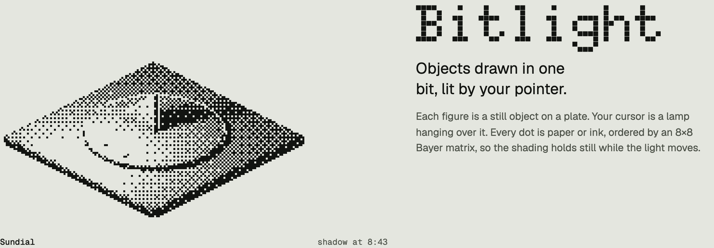
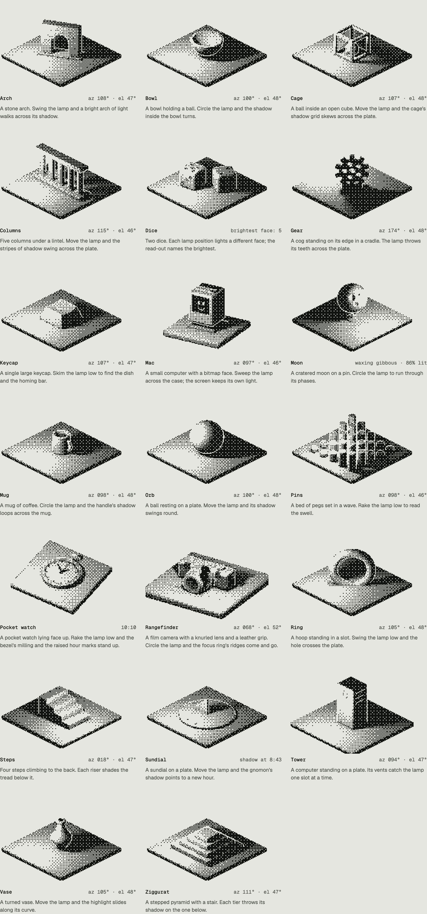
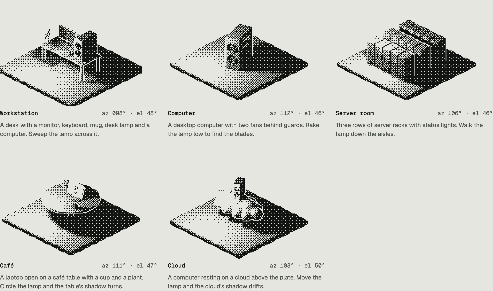
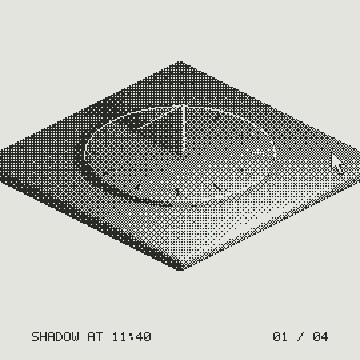
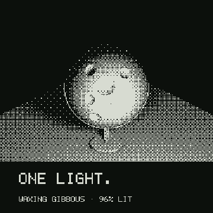
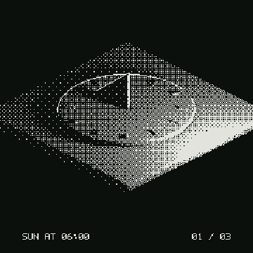
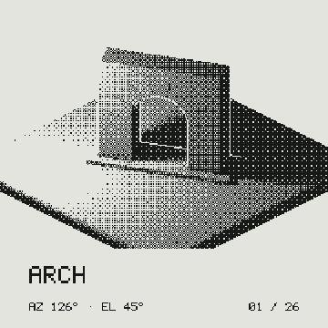
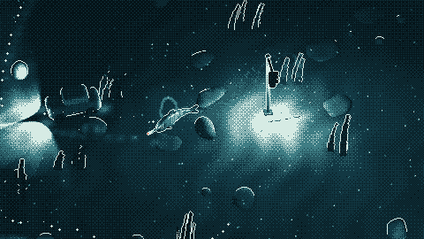

<div align="center">

<picture>
  <source media="(prefers-color-scheme: dark)" srcset="media/readme/hero-dark.png">
  
</picture>

</div>

# Bitlight

**Objects drawn in one bit, lit by your pointer.**

Twenty-five 3D figures for the web: twenty objects and five whole scenes.
Each sits on a plate; the cursor is a lamp hanging over it. Every dot is paper
or ink, ordered by an 8×8 Bayer matrix, so the shading holds still while the
light moves. Canvas, no runtime dependencies, 33 kB (15 kB gzipped) for all
twenty-five.

There is also a film renderer in the same look (moving geometry, cameras and
lights; dot-matrix type; a square-wave score) and agent skills, so Claude Code
or Codex can make new figures and films and check their own frames.

**Site:** https://brk.bz/bitlight/

## Twenty-five figures

The frame at rest is the thumbnail, so each figure has a designed lamp
position. Nothing in a figure moves except the light. Some read-outs say more
than angles: the sundial tells the time, the moon names its phase, the dice
name the brightest face.

**Objects**

<picture>
  <source media="(prefers-color-scheme: dark)" srcset="media/readme/objects-dark.png">
  
</picture>

**Scenes**: whole set-ups built from shared props. Same kernel, same budget.

<picture>
  <source media="(prefers-color-scheme: dark)" srcset="media/readme/scenes-dark.png">
  
</picture>

```
objects  Arch · Bowl · Cage · Columns · Dice · Gear · Keycap · Mac · Moon · Mug · Orb
         Pins · Pocket watch · Rangefinder · Ring · Steps · Sundial · Tower · Vase · Ziggurat
scenes   Workstation · Computer · Server room · Café · Cloud
```

## Install

```bash
npm i github:berkboz/bitlight      # npm i bitlight once it is on npm
```

**ES module**

```js
import { mount, sundial } from "bitlight";

const fig = mount(document.getElementById("figure"), sundial, {
  cell: 3,             // CSS px per dot (integer)
  theme: "auto",       // "light" (paper ground) | "dark" (night ground) | "auto"
  onRead: (text) => (caption.textContent = text),   // "shadow at 10:40"
});
// fig.lampAt(u, v) · fig.rest() · fig.retheme("dark") · fig.destroy()
```

**React 18+**

```jsx
import { Bitlight } from "bitlight/react";
import { moon } from "bitlight";

<Bitlight figure={moon} cell={3} onRead={setCaption} />
```

**Script tag**

```html
<div id="figure"></div>
<script src="https://cdn.jsdelivr.net/gh/berkboz/bitlight/dist/bitlight.global.js"></script>
<script>Bitlight.mount(document.getElementById("figure"), "orb", { cell: 3 });</script>
```

**shadcn**: vendors the source into `lib/bitlight`:

```bash
npx shadcn@latest add https://berkboz.github.io/bitlight/registry/bitlight.json
```

### Ink, screen, lamp

Four knobs, all optional, all live (`handle.set()`), none of them re-march the
geometry. Full reference, ranges and the roadmap: [`docs/CONTROLS.md`](docs/CONTROLS.md).

```js
mount(el, sundial, {
  ink: { lit: "#f04820", unlit: "#0f0f0f" },   // any two CSS colours
  screen: "dots",                               // bayer · bayer4 · dots · lines · diagonal · noise
  tones: 4,                                     // 2 (default, one bit) to 16 inks; or palette: ["#000", ...]
  light: { power: 3.2, falloff: 0.32, ambient: 0.035, contrast: 0.72, spot: true },
});
fig.set({ screen: "lines" });   // partial updates; fig.options returns what is live
```

- **Ink.** `ink`, or two CSS custom properties on the host or any ancestor
  (`--bitlight-lit`, `--bitlight-unlit`), which recolour every figure below
  them. `theme: "light"` paints empty ground with `lit`, `"dark"` with `unlit`.
  Keep 3:1 contrast or the edges sink.
- **Tones.** `2` is one bit. `4`, `8`, `16` step through more inks between `unlit` and `lit`, or give an exact `palette`.
- **Screen.** The order dots switch on, so the texture of the shading. Always an
  ordered 8×8 map, never diffusion.
- **Lamp.** Still one light and one input. `spot` swaps the bare lamp for a cone.

Try them live in the **Lab** on the site; it writes the matching snippet and the
page URL is a shareable link to the look.

### Behaviour

- One `requestAnimationFrame` for the whole page; off-screen or settled figures
  do no work.
- A stiff spring follows the pointer; a soft one carries the lamp home on leave.
  `prefers-reduced-motion` places the lamp directly.
- Keyboard: focus a figure, arrows move the lamp, Esc rests. Each figure has
  `role="img"` and an `aria-label` from its `means`.
- Geometry is ray-marched once at mount (30–190 ms); re-lighting costs 1–14 ms.

### On the GPU

For moving geometry, many lights, every frame. `bitlight/gpu` runs the same
kernel (`src/core.js`: march, soft shadow, shade, halo, screens) as a WebGL2
shader; the scene is GLSL with the same `sd` helpers. Optional: `gpu()` returns
`null` without WebGL2 and float render targets, and nothing else needs it.

```js
import { gpu } from "bitlight/gpu";

const view = gpu(canvas, { glsl: `
  float map(vec3 p) { return min(p.y, sdSphere(p - vec3(0, .62 + .1 * sin(uTime), 0), .62)); }
  float occ(vec3 p) { return sdSphere(p - vec3(0, .62 + .1 * sin(uTime), 0), .62); }  // casters only
  void material(vec3 p, vec3 n, inout Mat m) { m.a = 0.9; }` });
view.render({ lights: [{ p: [-0.9, 1.6, 1.2] }], tones: 4, time: performance.now() / 1000 });
```

For geometry that follows something outside the shader, declare a uniform in the
GLSL (`uniform vec3 uBall;`) and pass `uniforms: { uBall: [x, y, z] }` to `render()`.

## Your own pictures and video

The same screens work on photographs, video and a camera feed. Nothing is
uploaded: it runs in your browser or with FFmpeg on your machine.

- **In the browser:** [`photo.html`](photo.html), live at https://brk.bz/bitlight/photo/.
  Drop an image or a video, or switch on the camera. Pick ink and screen, tune
  contrast, mid-tones and sharpness, then save a PNG or record the result as video.
- **As a command** (needs FFmpeg):

```bash
node bitlight.mjs image portrait.jpg --screen dots --ink f04820,0f0f0f
node bitlight.mjs video clip.mp4 --tones 4 --palette 0f380f,306230,8bac0f,9bbc0f --cols 240
```

  Options: `--cols` dots across, `--cell` pixels per dot, `--screen`, `--tones`,
  `--ink LIT,UNLIT` or `--palette A,B,...`, `--contrast --brightness --gamma
  --sharpen --invert --no-auto`, and for video `--fps`, `--smooth` (temporal
  steadiness) and `--no-audio`. Audio is kept.
- **As a library:** `bitlight/image` (`process`, or the steps: `lumaFromRGBA`,
  `toGrid`, `tune`, `dither`, `paint`). No DOM, no decoding, so it runs anywhere.

Tips: more dots (`--cols 320`+) gives faces enough detail at 1 bit; 4 tones holds
a face with far fewer; `--sharpen` is what keeps thin edges alive. Because every
screen is fixed, dither does not crawl between video frames.

## Make a figure

A figure is one file with one `define()` call:

```js
import { define, sd } from "bitlight";

export default define({
  name: "Orb",
  means: "A ball resting on a plate. Move the lamp and its shadow swings round.",
  sdf: (x, y, z) => sd.sphere(x, y - 0.62, z, 0.62),  // plate top is y = 0
  bound: [0, 0.62, 0, 0.64],                           // sphere enclosing it
  rest: [-0.25, 1.5, 1.35],                            // lamp at rest = the thumbnail
});
```

Scenes compose the shared props in `src/props.js` (a computer with fans, a desk
set, server racks, a café table with a laptop, a cloud). See
`src/figures/workstation.js`.

The full workflow (pitch, build, check, look) is
[`skills/bitlight-create/SKILL.md`](skills/bitlight-create/SKILL.md), written for
an AI agent and readable by people. In short:

```bash
node build.mjs                 # regenerate index, bundle, registry
node look.mjs mine             # eight lamps, rule checks → sheets/mine-light.png
node look.mjs mine --theme dark
```

Then open the sheets. Passing is necessary, not sufficient.

## The ten rules

| # | Rule | |
|---|---|---|
| 01 | Two inks | Paper and ink, any two colours. No grey, no alpha, no anti-aliasing. |
| 02 | One light | The pointer is the only input. Geometry never moves in a figure. |
| 03 | Reach | The lamp is clamped to the plate; at the far edge the figure is still composed. |
| 04 | Order | Ordered screens only (Bayer by default), never error diffusion: diffused dots crawl when the light moves. |
| 05 | Edge | A one-dot paper gap separates a near silhouette from what is behind it. |
| 06 | Range | Every lamp position leaves both inks on the plate. |
| 07 | Rest | The rest frame is the thumbnail. Light the faces the camera sees. |
| 08 | Clock | A stiff spring follows; a soft one carries the lamp home. |
| 09 | Cost | One frame loop; settled figures sleep; re-light < 16 ms. |
| 10 | Quiet | No text inside a figure. Words live in the read-out. |

Details and how each is enforced: [`skills/bitlight-create/rules.md`](skills/bitlight-create/rules.md).

## Films, same look

Same lighting code as the figures (`src/core.js`), but geometry, cameras and
lights may move every frame. Words are drawn on the same dot grid; shots cut
hard; the score is square waves. The square ones are made for feeds. Needs FFmpeg.

| | | | |
|:-:|:-:|:-:|:-:|
|  |  |  |  |
| [Move the light](media/pointer.mp4) | [One light](media/moon-loop.mp4) | [A day, fast](media/sundial-day.mp4) | [Twenty-five](media/montage.mp4) |

Previews are silent GIFs; the links open the full films with sound
(mp4 and webm in [`media/`](media/)). The 16:9 one, [`scenes`](media/scenes.mp4),
is 35 s of the props in motion.

| Film | Format | What it shows |
|---|---|---|
| `pointer` | 1:1 · 13 s | a cursor drives the lamp across four figures |
| `moon-loop` | 1:1 · 8 s | one orbit of the lamp, every phase, loops seamlessly |
| `sundial-day` | 1:1 · 11 s | dawn, a day, dusk; the read-out is the clock |
| `montage` | 1:1 · 16 s | all 25 figures on the beat |
| `launch` | 16:9 · 42 s · 4K | the launch film: a dead image, a cursor that lights it, a pocket watch, a Mac, the library on the beat, a build-up, the install line |
| `launch-spin` | 16:9 · 27 s · 4K | the objects themselves turn: turntable, racing hands, an orbiting camera, twelve figures spinning on the beat |
| `launch-teaser` | 16:9 · 15 s · 4K | the first beats of `launch`, for the day before |
| `launch-loop` | 1:1 · 13 s | rangefinder, pocket watch and Mac lit by a cursor, for feeds |
| `scenes` | 16:9 · 35 s | the props in motion: fans, a lift, a walking lamp, a lid opening |

```bash
node film/check.mjs  --film pointer          # rules + contact sheet
node film/render.mjs --film pointer --stills 2,8
node film/render.mjs --film pointer && node film/score.mjs --film pointer && node film/mux.mjs --film pointer
```

A film is one file: shots that are pure functions of time, plus a score.
Films of figures are a few lines each (`film/films/pointer.mjs`); `--film`
also takes a path, so films can live in another project. Workflow and lessons:
[`skills/bitlight-film/SKILL.md`](skills/bitlight-film/SKILL.md).

## Made with Bitlight

<a href="https://theorkan.com/fish/"></a>

**[Fish](https://theorkan.com/fish/)** by [Orkan Celikhisar](https://github.com/orkancelikhisar).
A fish smoking a cigarette in an endless deep sea. It follows your pointer; hold
to take a drag, let go to exhale. Orkan moved the kernel (the lamp model and the
Bayer screen) into a WebGL2 fragment shader, so the look runs on the GPU instead
of the CPU: many lights, moving geometry, every frame.
[14 s clip](media/made-with/fish.mp4).

Built something on it? Open a PR that adds it here.

## Layout

```
src/core.js        the look: lamp model, tone, shadow, screens, halo (no DOM)
src/bitlight.js    define() + mount(): cache, input, motion, a11y
src/gpu.js         the same look as a WebGL2 shader, for scenes written in GLSL (optional)
src/props.js       shared geometry for scenes and films
src/react.js       <Bitlight />
src/figures/       one file per figure (index.js is generated)
film/              offline renderer: engine, figure, type, frame, render, score, mux, check
film/films/        the films above
docs/CONTROLS.md   ink, screen, lamp: reference and plan
skills/            agent skills: bitlight-create, bitlight-film
media/             rendered films for the site; made-with/ holds clips of other people's work
look.mjs           figure checker + frame sheets
test/smoke.mjs     package test (import, bounds, types, bundle, React, registry)
build.mjs          generated files; --check for CI
index.html         the site: inspector, Lab, gallery, films
photo.html         photo, video and camera tool (runs in the browser)
bitlight.mjs       the same as a command: image and video through FFmpeg
src/image.js       the picture pipeline (no DOM)
```

## Development

Node 20+, Chromium via Playwright, FFmpeg for films.

```bash
npm install
npm run serve      # http://127.0.0.1:5173 (ES modules need http, not file://)
npm run check      # everything CI runs
```

## Credits

The structure (a fixed kernel, written rules, and an agent skill that checks
its own frames) follows [Hairline](https://github.com/lucasmarkes/hairline) by
Lucas Markes. The look, kernel, figures and films are original.

MIT.
